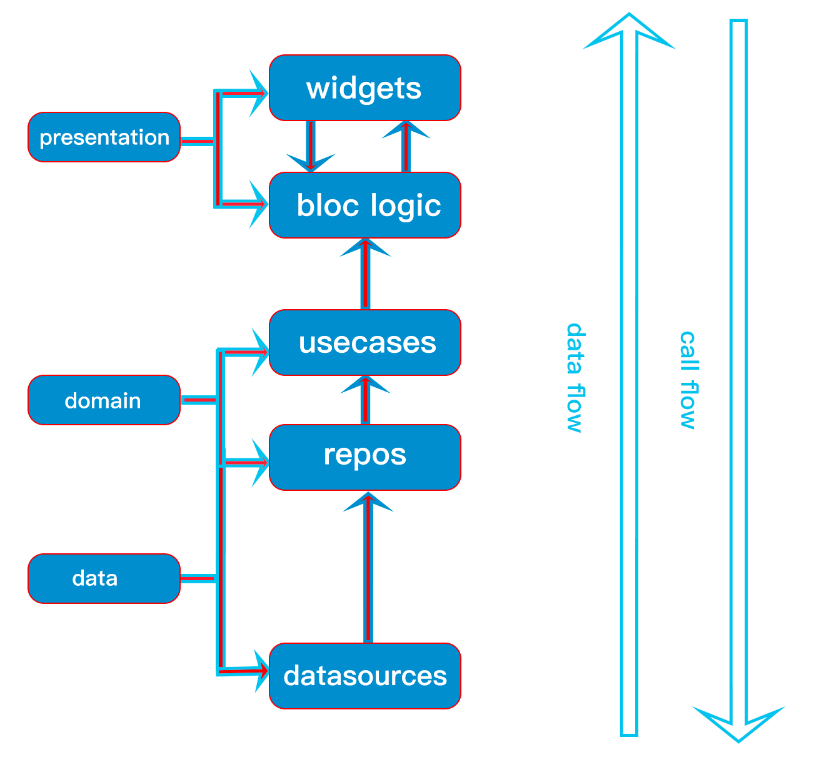

# Faisal's Starter Code Flutter

> Version 1.0.0

This repository contains my starter code for a Flutter project, which is highly inspired by [dbestech](https://dbestech.com) and [Very Good Ventures](https://verygood.ventures).

For quick installation, you can run the following command:

**Linux & MacOS:**

```bash
curl -s https://raw.githubusercontent.com/fzl-22/faisal-starter-code-flutter/master/install.sh > install.sh && bash install.sh
```

> Note: `gnu-sed` is required for installation on MacOS (`brew install gnu-sed`)

## Table of Contents

- [1 Technology Stack](#1-technology-stack)
- [2 Dependencies](#2-dependencies)
- [3. Directory Structures and Architectural Overviews](#3-directory-structures-and-architectural-overviews)
  - [3.1 `assets/`](#31-assets)
  - [3.2 `lib/`](#32-lib)
    - [3.2.1 `lib/core/`](#321-libcore)
    - [3.2.2 `lib/src/`](#322-libsrc)
- [4 Guides](#4-guides)
  - [4.1 Setup Project](#41-setup-project)
    - [4.1.1 Clone project](#411-clone-project)
    - [4.1.2 Get all dependencies](#412-get-all-dependencies)
    - [4.1.3 Run the code generator](#413-run-the-code-generator)
  - [4.2 Run project](#42-run-project)
  - [4.3 Installing and removing packages](#43-installing-and-removing-packages)
- [5 Documentation](#5-documentation)

## 1 Technology Stack

| Software | Version |
| -------- | ------- |
| Flutter  | 3.19.2  |
| Dart     | 3.3.0   |
| OpenJDK  | 11.0.22 |

## 2 Dependencies

| Package                                                               | Description                                                                                                           |
| --------------------------------------------------------------------- | --------------------------------------------------------------------------------------------------------------------- |
| [bloc](https://pub.dev/packages/bloc)                                 | State management library that helps implement the BLoC design pattern.                                                |
| [cached_network_image](https://pub.dev/packages/cached_network_image) | Loads and caches network images.                                                                                      |
| [dartz](https://pub.dev/packages/dartz)                               | Functional programming in Dart (used for clean error-handling)                                                        |
| [dio](https://pub.dev/packages/dio)                                   | HTTP networking package with supports on Interceptor, request cancellation, timeout, and etc.                         |
| [envied](https://pub.dev/packages/envied)                             | Explicitly reads environment variables into a dart file from a .env file for more security and faster start up times. |
| [equatable](https://pub.dev/packages/equatable)                       | Value-based objects comparison.                                                                                       |
| [flutter_bloc](https://pub.dev/packages/flutter_bloc)                 | Flutter Widgets that make it easy to implement the [bloc](https://pub.dev/packages/bloc)                              |
| [flutter_dotenv](https://pub.dev/packages/flutter_dotenv)             | Load configuration at runtime from a `.env` file                                                                      |
| [flutter_svg](https://pub.dev/packages/flutter_svg)                   | SVG rendering widget from an asset.                                                                                   |
| [freezed_annotation](https://pub.dev/packages/freezed_annotation)     | Annotations for [freezed](https://pub.dev/packages/freezed).                                                          |
| [get_it](https://pub.dev/get_it)                                      | Simple direct Service Locator for dependency injection.                                                               |
| [go_router](https://pub.dev/packages/go_router)                       | Routing package with URL-based API.                                                                                   |
| [injectable](https://pub.dev/packages/injectable)                     | Code generator for [get_it](https://pub.dev/get_it)                                                                   |
| [logger](https://pub.dev/packages/logger)                             | Beautiful log printer.                                                                                                |
| [provider](https://pub.dev/packages/provider)                         | A wrapper around `InheritedWidget`. Used for local state-abstraction.                                                 |
| [safe_change_notifier](https://pub.dev/packages/safe_change_notifier) | Safer replacement for `ChangeNotifier` and `ValueNotifer`.                                                            |
| [talker_dio_logger](https://pub.dev/packages/talker_dio_logger)       | Lightweight and customizable dio http client logger on talker base.                                                   |
| [bloc_test](https://pub.dev/packages/bloc_test)                       | Testing library for blocs and cubits (_dev_dependencies_)                                                             |
| [build_runner](https://pub.dev/packages/build_runner)                 | A build system for Dart code generation and modular compilation (_dev_dependencies_)                                  |
| [envied_generator](https://pub.dev/packages/envied_generator)         | Generator for [https://pub.dev/packages/envied](envied) (_dev_dependencies_).                                         |
| [freezed](https://pub.dev/packages/freezed)                           | Code generation for immutable classes (_dev_dependencies_).                                                           |
| [injectable_generator](https://pub.dev/packages/injectable_generator) | A generator for [injectable](https://pub.dev/packages/injectable_generator) library (_dev_dependencies_)              |
| [mocktail](https://pub.dev/packages/mocktail)                         | Mock library which simplifies mocking with null safety support (_dev_dependencies_)                                   |
| [very_good_analysis](https://pub.dev/packages/very_good_analysis)     | Lint rules for Dart and Flutter by Very Good Ventures (_dev_dependencies_).                                           |

## 3. Directory Structures and Architectural Overviews

### 3.1 `assets/`

This directory contains asset resources such as fonts, images, icon, and etc. Any new asset must be registered to [pubspec.yaml](./pubspec.yaml) and [lib/core/resources](./lib/core/resources/).

### 3.2 `lib/`

Here resides the application source code. Contains only [lib/core/] and [lib/src/].

#### 3.2.1 `lib/core/`

Contains core features and utilities of the app written **mostly** in Dart code (_almost framework-independent_).

##### 3.2.1.1 `lib/core/common/`

Contains application-wide shared themes, widgets, screens, or state.

##### 3.2.1.2 `lib/core/constants/`

Contains application-wide constant values.

##### 3.2.1.3 `lib/core/errors/`

Contains predefined exceptions and failures.

##### 3.2.1.4 `lib/core/extensions/`

Contains developer-defined extensions for built-in Dart object. This directory provides more-compact of some Dart object/method calls.

##### 3.2.1.5 `lib/core/injection/`

Contains injection of dependencies of the application architecture. This directory provides dependency injection container.

##### 3.2.1.6 `lib/core/resources/`

Contains registered constants that hold the value of each assets path in [assets/](./assets/) and defined typographies. This dependency provides UI assets consistency.

##### 3.2.1.7 `lib/core/router/`

Contains application routes and transitions. This directory defines routes configuration.

##### 3.2.1.8 `lib/core/usecase/`

Contains classes that encapsulate the business logic of the application (usecases).

##### 3.2.1.9 `lib/core/utils/`

Contains additional utilities to the application.

#### 3.2.2 `lib/src/`

This directory holds the features of the application. Any feature added in the application must reside in this directory as `lib/src/[feature]/`.

Each feature has 3 layers according to the Clean Architecture design by Robert C. Martin.


Source image: [dbestech.com](https://www.dbestech.com/)

So, each feature must have:

- `lib/src/[feature]/domain/`
- `lib/src/[feature]/data/`
- `lib/src/[feature]/presentation/`

##### 3.2.2.1 Domain Layer (`lib/src/[feature]/domain/`)

Domain layer contains the business logic of the application (core business logic, not BLoC logic).

> Domain does not depend on anyone. Presentation layer finds domain layer to work with.

This layer have 3 sublayers:

- `lib/src/[feature]/domain/entities/`
- `lib/src/[feature]/domain/repos/`
- `lib/src/[feature]/domain/usecases/`

###### 3.2.2.1.1 Entities (`lib/src/[feature]/domain/entities/`)

Entities hold the blue print of data model which we will pass around for a certain features or screens or pages.

###### 3.2.2.1.2 Repositories (`lib/src/[feature]/domain/repos`)

Domain repositories contains abstract classes that defines a contract between domain layer and data layer.

> The method of repository must be implemented in the data layer's repository.

###### 3.2.2.1.3 Usecases (`lib/src/[feature]/domain/usecases`)

Usecases contains communication tunnel between presentation and domain layer

> Usecases depend on repositories and should be independent of anything outside of domain layer.

##### 3.2.2.2 Data Layer (`lib/src/[feature]/data/`)

Data layer is an interface to communicate with data outside the app (remote or local).

> Data layer depends on domain layer.

This layer have 3 sublayers:

- `lib/src/[feature]/data/models/`
- `lib/src/[feature]/data/repos/`
- `lib/src/[feature]/data/datasources/`

###### 3.2.2.2.1 Models (`lib/src/[feature]/data/models/`)

Model is an extension of the _extensions_. This sublayer provides JSON serialization or constructorss to interact with outside data.

###### 3.2.2.2.2 Repositories (`lib/src/[feature]/data/repos/`)

The repos in data layer is the implementation of the repos in the domain layer. It provides the communication with domain layers.

> Data layer's repositories depends on datasources.

###### 3.2.2.2.3 Data Sources (`lib/src/[feature]/data/datasources/`)

Data sources provides communication with data from outside (API, local storage, and etc).

> Data sources depends on external source, for example: http package.

##### 3.2.2.3 Presentation Layer (`lib/src/[feature]/presentation/`)

Presentation layer provides UI presented to the user. Flutter's code only resides here in `lib/src/[feature]/` directory.

DO NOT add framework-dependent code to any other layer than the presentation layer.

> Presentation layer is framework-dependent and depends on domain layer.

This layer **may have** 3 sublayers:

- `lib/src/[feature]/domain/bloc/`
- `lib/src/[feature]/domain/views/`
- `lib/src/[feature]/domain/widgets/`

This sublayer can have `providers` to manages local state-abstraction if necessary.

###### 3.2.2.3.1 BLoC (`lib/src/[feature]/presentation/bloc`).

BLoC contains the state management to controls UI state.

> BLoC is dependent to the domain layer's usecases.

It provides multilayer state-management between presentation layer and domain layer.

**Note:** It is recommended to inject BLoC to the widget tree via the [router](./lib/core/router/) instead of the root widget or inside a views.

###### 3.2.2.3.2 Views (`lib/src/[feature]/presentation/views`).

Views sublayer provides the screens of the feature. The state of the screens and widgets inside is controlled with state manager.

###### 3.2.2.3.3 Widgets (`lib/src/[feature]/presentation/widgets/`).

Provides the feature-wide shared widgets that resides in the views sublayer.

## 4 Guides

### 4.1 Setup Project

#### 4.1.1 Clone project

Clone this repository to your local machine.

```bash
git clone git@github.com:fzl-22/faisal-starter-code-flutter.git
```

#### 4.1.2 Get all dependencies

To get all dependencies, run the following command.

```bash
flutter pub get
```

#### 4.1.3 Run the code generator

In a newly cloned project, you will notice that some files with `*.g.dart`, `*.config.dart`, and `*.freezed.dart` are missing. You need to generate those files with [build_runner](https://pub.dev/packages/build_runner).

```bash
dart run build_runner build # one time and exits
```

or

```bash
dart run build_runner watch # watch and rebuild as necessary
```

### 4.2 Run project

Turn on your Android emulator or physical device. Then, run the project.

```bash
flutter run
```

`flutter run` key commands.

- `r` to hot reload.
- `R` to hot restart.
- `h` to list all available interactive commands.
- `d` to detach (terminate "flutter run" but leave application running).
- `c` to clear the screen
- `q` to quit (terminate the application on the device).

### 4.3 Installing and removing packages

Install a package.

```bash
flutter pub add {package}
```

Install a package as `dev_dependencies`.

```bash
flutter pub add dev:{package}
```

Uninstall a package.

```bash
flutter pub remove {package}
```

## 5 Documentation

The documentation of this project can be generated using [dartdoc](https://pub.dev/packages/dartdoc).

Install compatible version of `dartdoc`.

```bash
fvm dart pub global activate dartdoc
```

In the project root directory, generate HTML documentation.

```bash
dart doc .
```

> Make sure you have no error in the source code

Your generated documentation will be on `doc/api/` directory.

Serve the docs with [dhttpd](https://pub.dev/packages/dhttpd) package (install with `fvm dart pub global activate dhttpd`).

```bash
dhttpd --path doc/api
```

You can read the documentation at `http://localhost:8080`.
